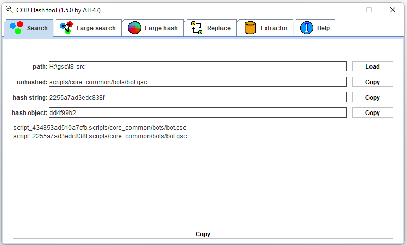
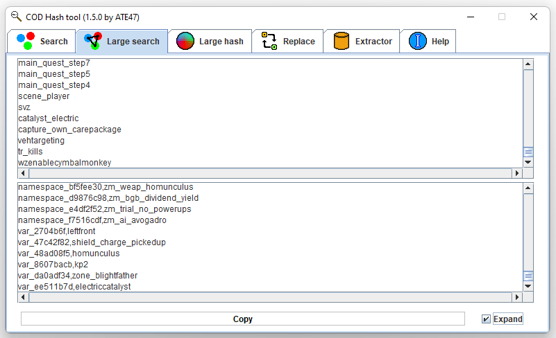
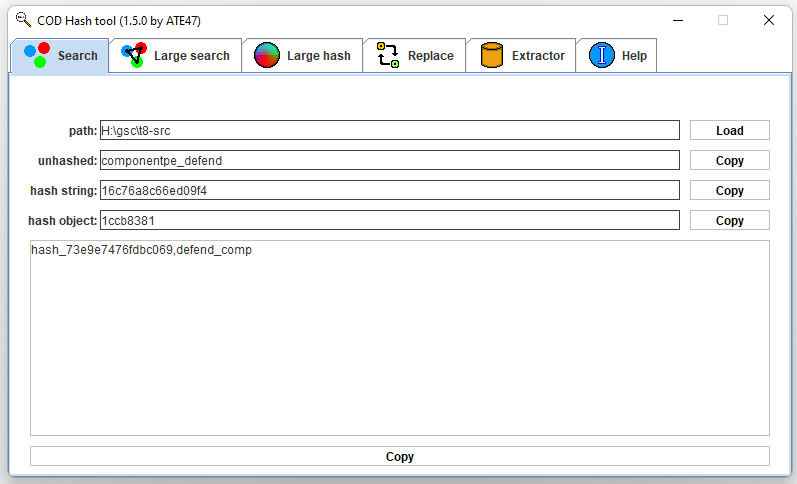

# BOHashTool

Tool to try hashes in a directory of GSC files, I made it like that, you can use something else if you want.

For a Java implementation of the hashing methods,
the [fr.atesab.bo4hash.utils.HashUtils](src/main/java/fr/atesab/bo4hash/utils/HashUtils.java) is here

I use it to explore this fork repository: https://github.com/ate47/t8-src

## Usage

From the release files or via these commands to compile:

```powershell
./gradlew build
java -jar build/libs/BOHashTool-*.jar
```

## Hash searcher macro

All `.gsc` search are also converted into a `namespace` search (with the script's name) and into a `.csc` search with
the same path.

You can use `|` to tell prefix and suffix in a hash search

example:

```
scripts/mp_common/|player_s_s|.gsc
```

will match all strings with the prefix `scripts/mp_common/`, the suffix `.gsc` and contain a permutation
of `player_s_s`.

For example 
- `scripts/mp_common/player/player.gsc`
- `scripts/mp_common/player/player.csc`

## Demo

You can search for an unhashed string in a particular repo (the indexing can take ~20s or more for slower disks)


It can be used to search for multiple objects at once


Or path



You can use it to search over multiple fields at the same time



It will compute the permutations of a string to find close values



You can hash multiple values without searching them in a repository (useful to get the hashes of multiple IDs already found)


The hashes found, you can replace them in the GSC directory using the replace tool


You can get all the hashes/scripts of a dataset using the extractor tool


Using the lookup tool, you can search for a particular id in a strings file


A version is of lookup tool is available for large search (can be long for large queries)

